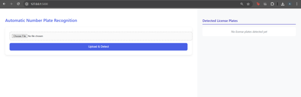
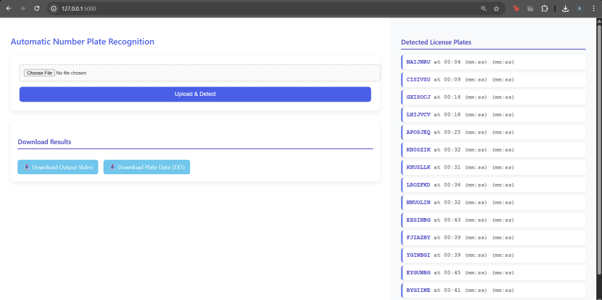
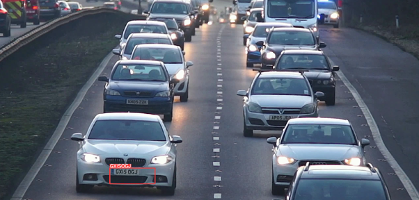
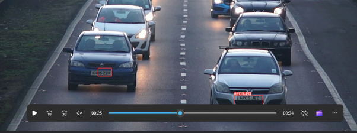

# Automatic Number Plate Recognition (ANPR)

An AI-powered Automatic Number Plate Recognition (ANPR) web application that detects vehicle license plates from uploaded videos, extracts plate numbers using OCR, and stores the results in a MySQL database. Built using YOLOv8, EasyOCR, Flask, and MySQL. :contentReference[oaicite:0]{index=0}

## Features

- Upload vehicle surveillance videos through a web interface
- Detect license plates using a custom-trained YOLOv8 model
- Extract plate numbers using EasyOCR
- Store detected plates and timestamps in MySQL
- Download processed videos with annotations
- Download detected plate records
- View detected license plates and timestamps in the browser
- Unique tracking for every uploaded video using UUIDs :contentReference[oaicite:1]{index=1}

## Tech Stack

- Python
- Flask
- YOLOv8
- EasyOCR
- OpenCV
- MySQL
- HTML/CSS
- Ultralytics

## Project Structure

```text
automatic_number_plate_detection/
│
├── app.py
├── predict_modified.py
├── utils_locator.py
├── templates/
├── static/
├── ultralytics/
├── data.yaml
├── train.py
└── README.md
```

## System Workflow

1. User uploads a video file.
2. Flask processes the upload request.
3. YOLOv8 detects license plates frame by frame.
4. EasyOCR extracts text from detected plates.
5. Detected plates and timestamps are stored in MySQL.
6. The processed video and results are displayed and made available for download. :contentReference[oaicite:2]{index=2}

## Database

### videos

| Column | Description |
|----------|-------------|
| id | Unique video ID |
| original_filename | Uploaded file name |
| processed_video_path | Output video path |
| detected_text_path | Output text file |
| upload_time | Upload timestamp |

### plates

| Column | Description |
|----------|-------------|
| id | Auto-generated ID |
| video_id | Linked video ID |
| plate_number | Detected license plate |
| plate_time | Timestamp in video |

:contentReference[oaicite:3]{index=3}

## Screenshots

### 🏠 Home Page

<p align="center">
  
</p>

The main interface for uploading surveillance videos.

---

### 🚗 Detected License Plates

<p align="center">
  
</p>

Detected license plates with timestamps extracted from the video.

---

### 🎯 Detection Results

<p align="center">
  
  
</p>

License plate detection results using YOLOv8 and EasyOCR.

## Installation

### Clone the Repository

```bash
git clone https://github.com/abii-16/anpr.git
cd anpr
```

### Install Dependencies

```bash
pip install -r requirements.txt
```

### Configure MySQL

Create a database:

```sql
CREATE DATABASE anpr;
```

Update your MySQL credentials in the application configuration.

### Run the Application

```bash
python app.py
```

Open:

```text
http://127.0.0.1:5000
```

## Model Training

Dataset was prepared using Roboflow and trained using YOLOv8.

```bash
yolo task=detect model=yolov8n.pt data=data.yaml epochs=20 imgsz=640
```

For better accuracy, training with more epochs is recommended. :contentReference[oaicite:4]{index=4}

## Future Enhancements

- Real-time CCTV stream processing
- User authentication system
- Analytics dashboard
- Excel/CSV export support
- Improved OCR using TrOCR or CRNN models :contentReference[oaicite:5]{index=5}

## Applications

- Smart City Infrastructure
- Traffic Monitoring
- Parking Management
- Security Surveillance
- Law Enforcement Systems :contentReference[oaicite:6]{index=6}

## Author

**Abinaya Radhakrishnan**

GitHub: https://github.com/abii-16